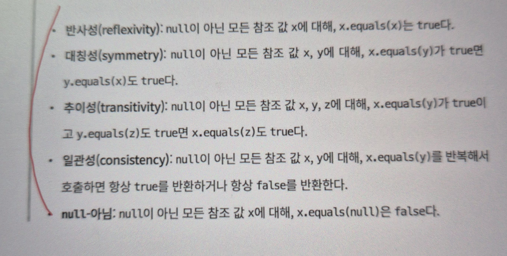

Object는 객체를 만들 수 있는 구체 클래스지만 기본적으로는 **상속**해서 사용하도록 설계되었음
<br>ex) equals, hashCode, toString, clone, finalize
<br>모두 재정의를 염두해둔 것이어서 일반 규약이 명확이 명시되어 있음
<br>이번 작에서는 Object 메서드들의 재정의에 대해서 살펴보자!

# equals는 일반 규약을 지켜 재정의하라
- 재정의하지 않는 것이 최선인 경우
  - 각 인스턴스가 본질적으로 고유할 때. 값을 표현하는 게 아니라 동작하는 개체를 표현하는 클래스가 여기 해당
  - Thread가 좋은 에
- 인스턴스의 '논리적 동치성'을 검사할 일이 없다.
  - java.util.regex.Pattern은 equals를 재정의해서 두 Pattern의 인스턴스가 같은 정규표현식을 나타내는지 검사는 방법도 있음
- 상위 클래스에서 재정의한 equals가 하위 클래스에도 딱 들어맞는다.
  - 대부분의 Set 구현체는 Abstractset이 구현한 equals를, List 구현체들은 AbstractList로부터, Map 구현체들은 AbstractMap으로부터 상속받아 사용
- 클래스가 private이거나 package-private이고 equals 메서드를 호출할 일이 없다.
  - 혹시나 호출될 위험 막고 싶을 때
    ```java
    @Override public boolean equals(Object o){
        throw new AsserttionError(); // 호출 금지
    }
    ```
    
- equals를 재정의 해야하는 경우<br>
객체 식별성(물리적 동일성)이 아니라 논리적 동치성을 확인해야 하는데, 상위 클래스의 equals가 논리적 동치성을 비교하도록 재정의되지 않은 때
  - 그러나 값 클래스라 해도, 값이 같은 인스턴스가 둘 이상 만들어지지 않음을 보장하는 인스턴스 통제 클래스라면 equals 재정의하지 않아도 된다.(Enum 같은 것)

- equals 재정의 일반 규약

1. 반사성 : 단순히 말하면 객체는 자기 자신과 같아야 한다는 뜻 
2. 대칭성 : 두 객체는 서로에 대한 동치 여부에 똑같이 답해야 한다듣 뜻 
3. 추이성 : 첫 번째 객체와 두 번째 객체가 같고, 두 번째 객체와 세 번째 객체가 같다면, 첫 번째 객체와 세 번째 객체도 같아야 한다는 뜻
  <br>**상위 클래스에 없는 새로운 필드를 하위 필드에 추가하는 상황 - equals에 영향 줌**
```java
// (1) 기본 Point 클래스
public class Point {
    private final int x;
    private final int y;
    public Point(int x, int y) {
        this.x = x; this.y = y;
    }
    @Override
    public boolean equals(Object o) {
        if (!(o instanceof Point)) return false;
        Point p = (Point) o;
        return p.x == x && p.y == y;
    }
    // hashCode 생략
}

// (2) Point를 확장해 색상을 추가한 ColorPoint
public class ColorPoint extends Point {
    private final Color color;
    public ColorPoint(int x, int y, Color color) {
        super(x, y);
        this.color = color;
    }
    @Override
    public boolean equals(Object o) {
        if (!(o instanceof Point)) return false;
        // 만약 o가 순수 Point라면 (색상 정보가 없으므로) x,y 좌표만 비교
        // o가 ColorPoint라면 색상까지 비교
        if (!(o instanceof ColorPoint)) {
            // o가 순수 Point인 경우: x,y만 같으면 true
            return super.equals(o);
        }
        // o가 ColorPoint인 경우: x,y와 color까지 비교
        return super.equals(o) && ((ColorPoint)o).color.equals(color);
    }
    // hashCode 생략
}

```
equals 메서드는 어떻게 해야 하나? 그대로 둔다면 Point의 구현이 상속되어 색상 정보는 무시한 채 비교를 수행한다.
equals 규약을 어긴 것은 아니지만 중요한 정보를 놓치게 된다.

- cp1 = new ColorPoint(1, 2, RED)
- pp = new Point(1, 2)
- cp2 = new ColorPoint(1, 2, BLUE)
이라고 가정해 보자

cp1.equals(pp)를 보면, pp는 Point 타입이므로 super.equals(pp)를 호출해 true가 된다. (좌표만 비교)
pp.equals(cp2)도 마찬가지로 Point의 equals가 좌표만 비교하니 true가 된다.

하지만 cp1.equals(cp2)는 cp1과 cp2의 색상(RED vs BLUE)이 다르므로 false가 된다.

결과적으로:
cp1.equals(pp) == true
pp.equals(cp2) == true
cp1.equals(cp2) == false
이는 추이성(true → true → true)을 위반하는 예가 된다.

- 추이성지키는 법<br>
  ColorPoint가 Point를 확장하는 대신 내부에 Point 필드를 두고, 색상 정보까지 모두 고려하는 단일 equals를 구현하는 방법

```java
public class ColorPoint {
    private final Point point;   // 내부에 Point 인스턴스를 둠
    private final Color color;

    public ColorPoint(int x, int y, Color color) {
        this.point = new Point(x, y);
        this.color = Objects.requireNonNull(color);
    }

    @Override
    public boolean equals(Object o) {
        if (!(o instanceof ColorPoint)) return false;
        ColorPoint cp = (ColorPoint) o;
        return point.equals(cp.point) && color.equals(cp.color);
    }

    @Override
    public int hashCode() {
        return Objects.hash(point, color);
    }
}

```

4. 일관성
   두 객체가 같다면 (어느 하나 혹은 두 객체 모두가 수정 되지 않는 한)
   앞으로도 영원히 같아야 한다는 뜻이다. 가변 객체는 비교시점에 따라 서로
   다를 수도 혹은 같을 수도 있는 반면, 불변 객체는 한번 다르면 끝까지 달라야
   한다.

5. null-아님
객체가 null과 같지 않아야 한다는 것. <br>
o.equals(null)에서 NullPointerException 던지는 코드 막자.
